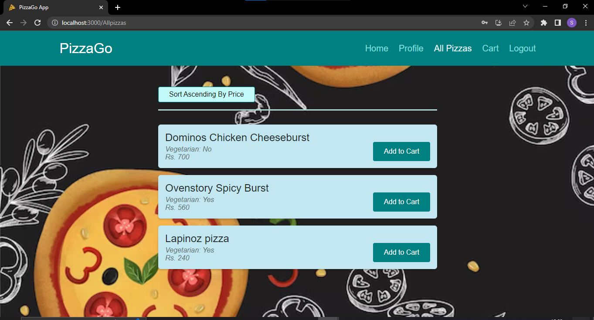
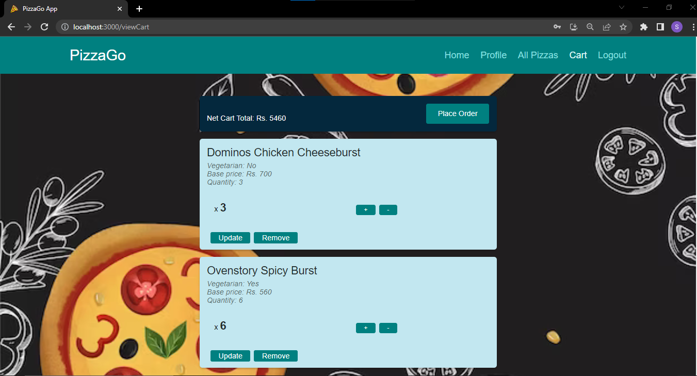
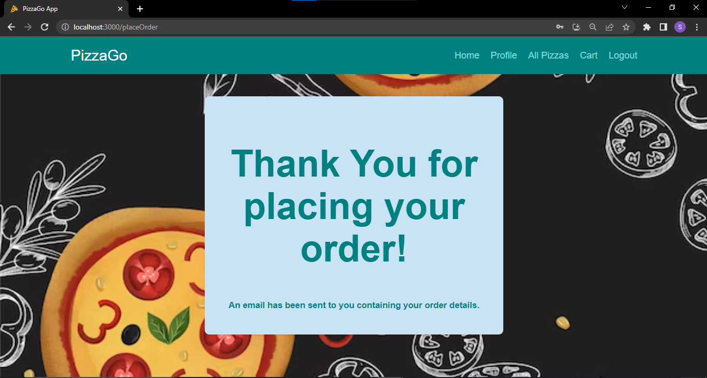

# PizzaGo-NestJS-App

<!-- TABLE OF CONTENTS -->
## Table of Contents

* [About the Project](#about-the-project)
  * [Description](#description)
  * [Technologies Used](#technologies-used)
  * [Screenshots](#screenshots)
* [Getting Started](#getting-started)
  * [Prerequisites](#prerequisites)
  * [Commands Used](#commands-used)


<!-- ABOUT THE PROJECT -->
## About The Project

### Description

A full-stack web development project built using **ReactJS**, **NestJS**, **MongoDB** and **Express**. It simulates a food delivery app for a pizza delivery company. It allows users to log in/sign up on the web app, view all the available menu items, perform CRUD operations on their cart, and place an order. After placing an order, the user receives a confirmation email containing details about their order, like quantity, item name, price, etc., on their email address. The admin can manage all the users and pizzas by performing CRUD operations on them.

### Technologies used

* React.js
* Nest.js
* MongoDB

### Screenshots






<!-- GETTING STARTED -->
## Getting Started

To get started with the project, follow these steps:

### Prerequisites

* Create a new .env file in backend folder whose contents are as follows -
```sh
MONGO_URL=
PORT=
MAILGUN_EMAIL_USERNAME=
MAILGUN_API_KEY=
MAILGUN_DOMAIN=
```
Assign the above variables the values that corresponds to your MongoDB database connection string, port for backend server, Mailgun email service username, APi key and Domain name.

### Commands used

Inside both the frontend and backend folder, run the following command - 
```sh
npm run start
```
